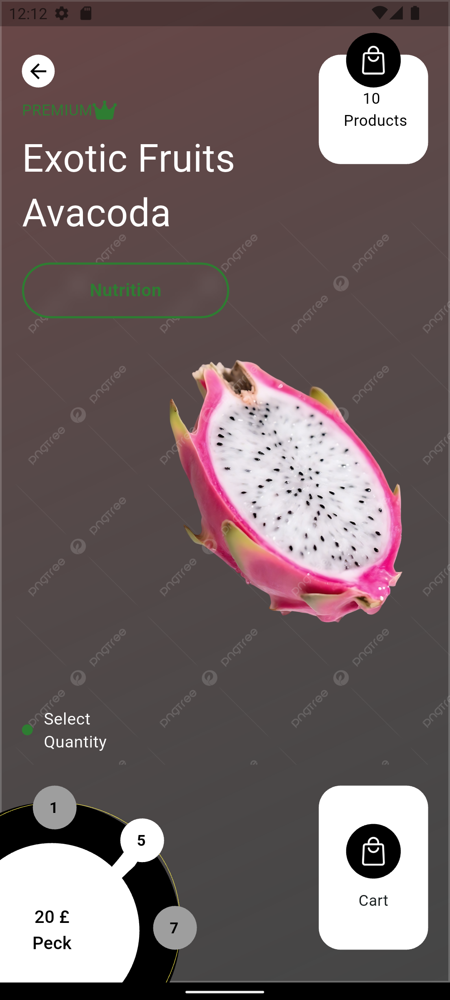
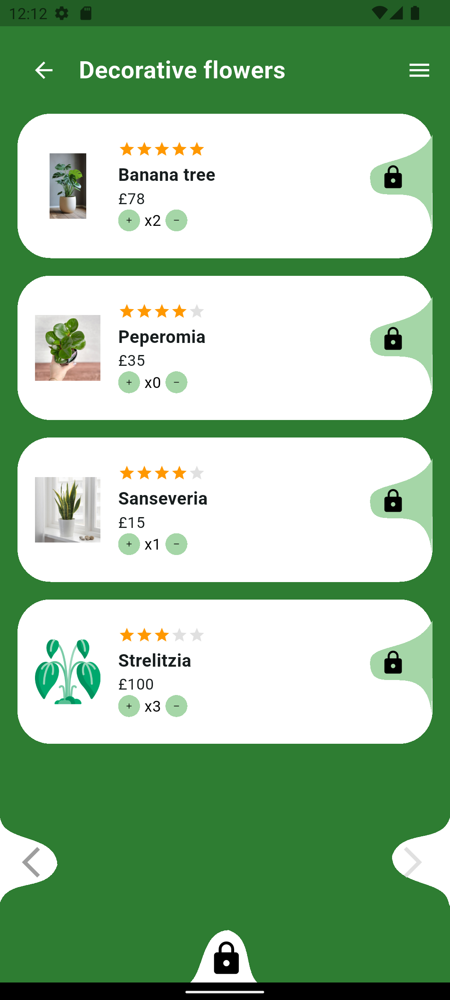
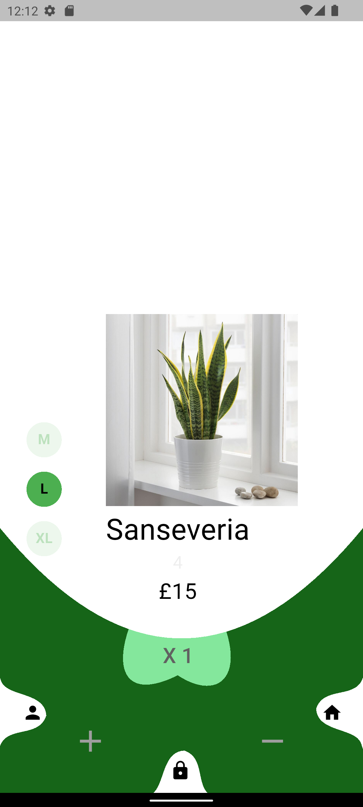

## 🎨 Flutter Custom Shapes & Complex UI

A Flutter project showcasing advanced custom shape drawing and complex UI design using CustomPainter, ClipPath, and layered layouts. This project demonstrates how to combine Flutter’s powerful rendering system with reusable widgets to build modern and visually rich user interfaces.

## ✨ Key Features

- 🖌️ Custom Shapes created with CustomPainter.

- 🔲 Curved Containers using ClipPath.

- 🎭 Layered Layouts with Stack and Positioned.

- 🌿 Decorative UI Components (plant cards, size selectors, lock overlays).

- ♻️ Reusable Widgets for clean and scalable code.

## 📸 Screenshots

| Home Screen               | Complex UI                 |
| ------------------------- | -------------------------- |
|   |   |
| Size Selector             | Custom Shapes              |
| ------------------------- | -------------------------- |
|     |     |

🛠️ Tech Stack

- Flutter – UI toolkit

- Dart – Programming language

- CustomPainter for shapes

- ClipPath for custom clipping

- Stack & Positioned for layered design

🚀 Getting Started
Clone the repository
git clone https://github.com/noRan56/flutter-custom-shapes-ui.git

Install dependencies

```
flutter pub get
```

Run the app

```
flutter run
```

📌 What I Learned

Implementing CustomPainter to design unique shapes in Flutter.

Overlaying widgets on painted shapes without breaking layout constraints.

Building complex, modern UI screens using Stack and ClipPath.

Writing modular and reusable widgets for better maintainability.

## 👩‍💻 Author

- Nouran Yasser

- GitHub: noRan56

- LinkedIn:
